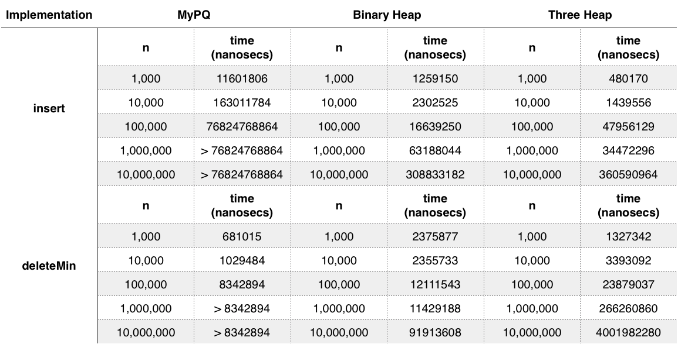

TITLE: README.txt
Author: FVCproductions

**FVCproductions**  
**Homework 3 - Priority Queues**  
**CSC252 - Data Structures II**  
**February 2015**  

---

# Questions

1. **What is the worst case asymptotic running time of isEmpty, size, insert, findMin, and deleteMin operations on all three of your heap implementations? For this analysis you should ignore the cost of growing the array.  That is, assume that you have enough space when you are inserting a value.**
	
	- Worst Case Running Times:
		- MyPQ
			- `isEmpty` - O(1)
			- `size` - O(1)
			- `insert` - O(1)
			- `findMin` - O(1)
			- `deleteMin` - O(n) 
		- Binary Heap
			- `isEmpty` - O(1)
			- `size` - O(1)
			- `insert` - O(log n)
			- `findMin` - O(1)
			- `deleteMin` - O(log n) 
		- Three Heap
			- `isEmpty` - O(1)
			- `size` - O(1)
			- `insert` - O(log n)
			- `findMin` - O(1)
			- `deleteMin` - O(log n) 

2. **Timing your code: Perform several timing experiments (similar to what you did in Homework 2, where you timed pieces of code), to examine the running time of all three of your heap implementations.  An experiment will include running the same client code (that uses a Priority Queue) for your three different heap implementations for at least four different values of N and timing this.  It is up to you to write and to determine what this client code should be.  Just be sure that it exercises your insert and deleteMin operations in a reasonable manner, including eventually deleting everything that has been inserted into the heap.  You are not required to explicitly measure calls to findMin, size, and isEmpty but feel free to do so if interested.  Similar to Homework 2, graphing your results is recommended, but a table of results will work also. Please note that similar to Homework 2, you are required to turn in the code you used to do your timing experiments.**
	
	See attached picture labeled `AnswerToQuestion2.png`.

	

3. **Compare what you see in your experiments, to what you expected to see based on a big-O analysis.  (This is also similar to what you did in Homework 2.) In your discussion, answer these questions:**
	
	***a. How useful was the asymptotic analysis for predicting the measured run time of insert and deleteMin for your three implementations?***
	It wasn't that useful because they were some differences that could be noted between the estimated and actual runtime.
	
	***b. If your predictions differed substantially from your measured times, gives reasons why this might have occurred.***  
	For `MyPQ`, the `insert` method was supposed to run constantly but instead ran in linear. `deleteMin` runs in quadratic time and every time n increases 10 fold, runtime increases by 100 fold. For `Binary Heap` and `Three Heap`, The `insert` and `deleteMin` operations were supposed to run in logarithmic time but they ran in a more linear time according to the table. When n increases 10 fold, so does the runtime. 
	
	***c. Which of your three implementations would you recommend to someone who needs to use a heap?  Why is that one preferred?  Are there any conditions under which you might suggest using your other implementations?***
	I'd go with Binary Heap because it can be used to implement Java's own built in priority queue. The one that would be preferred would probably be the Three Heap because the tree is more shallow but there is more work to be done. In terms of conditions, I would definitely not recommend MyPQ as an implementation because it is much slower with the `deleteMin` method (see table).

4. **Briefly discuss how you went about testing your three heap implementations.  Feel free to refer to your testing files, which you should submit.** 
	
	There were test files provided for each method, so I just based my main files off those. These are `MyPQTest.java`, `BinaryHeapTest.java`, and `ThreeHeapTest.java`. I was only responsible for creating 3 files and those were  `MyPQ.java`, `BinaryHeap.java`, and `ThreeHeap.java`.

5. **You implemented a binary-heap and a three-heap.  We could have also asked you to implement a four-heap, a five-heap, etc.** 
	
	***a. In a short table, indicate for a binary heap, a three-heap, a four-heap and a five-heap, where the children for the node at array index i are.  For example, the first row of the table would indicate that for a binary heap, the two children would be at i*2 and i*2+1.***
	
	See attached picture labeled `AnswerToQuestion5.png`.

	
	
	***b. For a d-heap where d is a variable representing the number of children (like two, three, four, and five ...), give an arithmetic formula for calculating where the left-most child for the node at array index i are. For example, a wrong answer in the right format would be i*d+14.  Naturally, your formula should produce the right answer for all the rows in your table from part (a).**
	
	The formula for the left-most child for the node at array index i is: `i * d - (d-2)`.

---

# **FILES THAT HAD TO BE CREATED/CHANGED & SUBMITTED**
	
- `MyPQ.java`
- `BinaryHeap.java` 
- `ThreeHeap.java`
- Any additional Java files needed, if any, for your three priority-queue implementations:
	- `PriorityQueue.java`
- The Java files you used to test your three implementations.
	- `MyPQTest.java`
	- `BinaryHeapTest.java`
	- `ThreeHeapTest.java`
- The Java files you used to time your three implementations.
	- `PriorityQueueTiming.java`
- `README.txt` containing answers to the Homework Questions. 
- Any additional files for the extra credit in a zip file named `extracredit.zip`.
