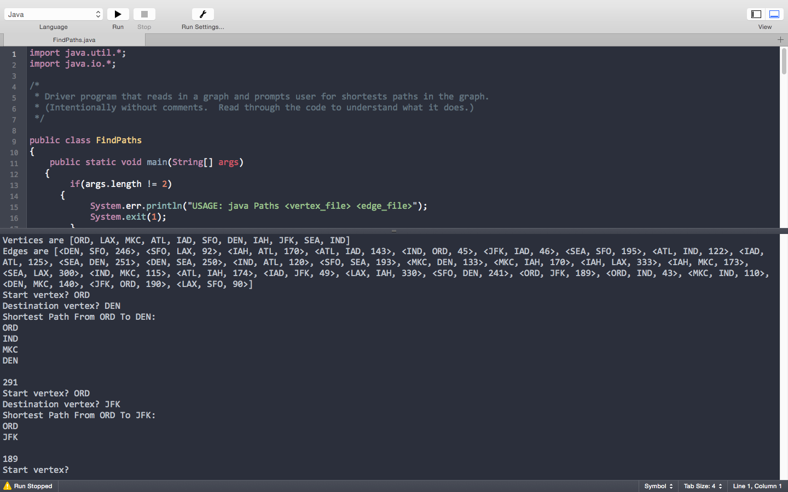
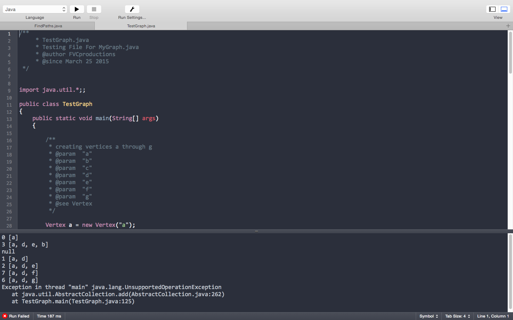

TITLE: README.txt
Author: FVCproductions

**FVCproductions**  
**Homework 5 - Graphs**  
**CSC252 - Data Structures II**  
**March 2015**  

---

# QUESTIONS

## 1. **Describe the worst-case asymptotic running times of your methods adjacentVertices, edgeCost, and shortestPath.  In your answers, use |E| for the number of edges and |V| for the number of vertices.  Explain and justify your answers.**

- `adjacentVertices` 
	- accesses `HashMap` (`O(1)` operation)
	- object has to be constructed before `adjacentVertices` method can be called
	- constructor has to evaluate each edge at least once
	- ergo, efficiency of `adjacentVertices` method is `O(|E|)`
- `edgeCost`
	- evaluates all of edges in worst case scenario
	- regardless of whether constructor is taken into account, efficiency is `O(|E|)`
- `shortestPath`
	-  evaluates each vertex in graph twice for worst case scenario so there is a runtime of `O(|V|^2)`
	- with constructor involved, runtime would be `O(|V|^2 + |E|)`.

## **Describe how you tested your code.**

I used the required `TestGraphs.java` file. 

Here are all I did was create the a to g vertices, and then added them to the hash set.

Having those in, I added on some random edges for the graph and printed out the shortest path for each vertex combo. 

I made sure each requirement for the path object that was laid out in the HW assignment was fulfilled:
- If there is no path, return null. 
- If the start and end vertex are equal, return a path containing one vertex and a cost of 0.
- Otherwise, the path will contain at least two vertices, the start and end vertices and any other vertices along the lowest-cost path.  The vertices should be in the order they appear on the path. 

### Output for `FindPaths.java`

### Output for `TestGraph.java`

## 3. **If you did any above-and-beyond, describe what you did.**

I did not go above and beyond.

---

# **FILES CREATED/CHANGED**

- `MyGraph.java` - Implementation of the Graph interface
	- 5 new methods (added after shortestPath() method)
		1. checkVertex - checks if vertex parameters exist in graph
		2. checkEdge - checks if there are duplicate edges with different weights
		3. checkUnknown - adds vertices 
		4. minNode - returns cheapest unknown vertex
		5. finalPath - determines path and cost from calling shortestPath()
- `FindPaths.java` - A client of the graph interface, *calling shortest path method and printing out shortest path*
- `TestGraph.java` - File used for testing
- 3 Exception Classes used for `checkEdge` method in `MyGraph.java`
	1. `DuplicateEdgeException.java` that tests for duplicates edges of different weights
	2. `InvalidEdgeException.java` that tests for every edge for a corresponding vertex/vertices
	3. `InvalidWeightException.java` that tests for edges of negative weight

---

# **FILES NOT CHANGED**

- `Graph.java` - Graph interface. 
- `Vertex.java` - Vertex class
- `Edge.java` - Edge class
- `Path.java` - Class with two fields for returning the result of a shortest-path computation
- `vertext.txt` and `edge.txt` - an example graph in the correct input format
